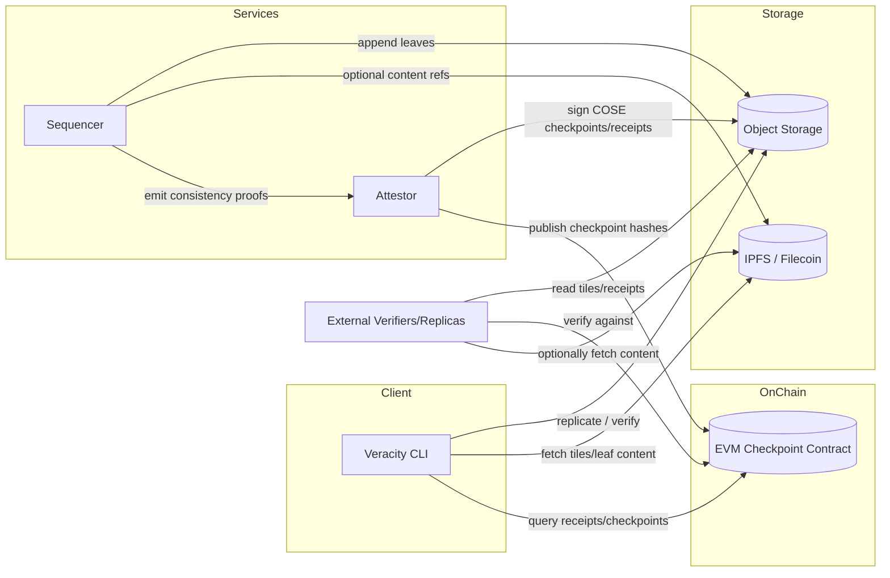

# Forestrie is a trust‑minimized digital provenance ledger

The software was originally created by DataTrails, Inc. as the underlay for their digital provenance platform and released under an MIT license to promote system transparency.

DataTrails was acquired by [OnID](https://onid.co/) in 2025, who continue to operate the platform.

The original software continues to be available and maintained at: <https://github.com/datatrails/>

This project (Forestrie) is an independent effort to continue the evolution of standards‑based, interoperable, and highly scalable provenance ledgers.

The most succinct overview of the relationship to the original software can be found here: <https://github.com/forestrie/merklelog-ci/blob/main/README.md>

---

## Project vision

1. Be an independent, production‑grade, interoperable transparency ledger.
2. Maintain compatibility with the evolving IETF drafts:
   - `draft-bryce-cose-receipts-mmr-profile-00`
   - `draft-ietf-cose-merkle-tree-proofs-16`
3. Maintain **veracity** as a vendor‑neutral tool for working with Forestrie logs.

### Near‑term feature goals

1. Split‑view protection: an EVM smart contract acts as the single source of truth for the **verified history of checkpoints** for logs (on‑chain verification of checkpoints/receipts).
2. Cloud‑vendor‑neutral & distrubuted storage: object storage with optimistic concurrency control as the primary substrate;
   ambition to take advantage of distributed storage/data‑availability approaches such as IPFS, Filecoin, Celestai, Avail and Eigen DA.
4. Production quality sequencer and attestor services.

### Near‑term maintenance goals

1. Evolve the log format: hash agility; generically verifiable index entries; simplifications (e.g., constant‑sized peak stack allowing node count from file size). _Note: constant‑sized peak stack is an implementation detail at this time and not an IETF requirement._
2. Reduce and simplify the implementation and testing surface.

---

## Ledger data format

### Forestrie ledger format, public documentation, and standards

The Forestrie ledger uses a system of binary‑encoded **Merkle Mountain Ranges (MMRs)**. A single log is a single MMR, organized as a linear set of “tiles.” A Forestrie system may maintain many logs.

- Navigating the format: <https://docs.datatrails.ai/developers/developer-patterns/navigating-merklelogs/>
- Peak stack / offset tables: <https://docs.datatrails.ai/developers/developer-patterns/massif-blob-offset-tables/> — ensures producing a proof for a single element never needs to reference adjacent tiles.

> Forestrie tiles are organised linearly, simplifying navigation and keeping proofs local to a single storage object.

### Receipts and standards

- Receipts and checkpoints: are described by the IETF Internet‑Draft: <https://www.ietf.org/archive/id/draft-bryce-cose-receipts-mmr-profile-00.html>
- The above is a profile of: <https://www.ietf.org/archive/id/draft-ietf-cose-merkle-tree-proofs-16.html>, which establishes registries for defining receipts for multiple, interoperable transparency systems.
- These IETF documents are referenced by the SCITT reference architecture: <https://www.ietf.org/archive/id/draft-ietf-scitt-architecture-20.html>

---

## Veracity: a tool for working with Forestrie logs

veracity is used to maintain independent, verifiable replicas of the ledger: <https://docs.datatrails.ai/developers/developer-patterns/3rdparty-verification/>

It also provides offline verification, proof (receipt) generation, and various ledger discovery and maintenance tooling.

Logs are attested by a single identity (which may gate access to the log), but in all other respects all log replicas are equal once data is attested.

Attestation is accomplished by signing COSE/CBOR checkpoints based on consistency proofs whose format is described in the `draft-bryce-cose-receipts-mmr-profile-00` document.

---

## Comparison with Certificate Transparency and Sunlight tiles

- Discussion relating this system to TLS Certificate Transparency and Sunlight tiles:  
  <https://github.com/robinbryce/mmriver-supplimental/blob/main/if-you-go-down-to-the-woods-today.md>
- Specific equivalences in the Merkle tree formats (1‑D↔2‑D mapping):  
  <https://github.com/robinbryce/draft-bryce-cose-merkle-mountain-range-proofs/blob/main/1d-2d-tree-equivalences.md>

---

## Implementations and algorithms

- **Python** reference algorithms (MMR/receipt primitives + tests):  
  <https://github.com/robinbryce/draft-bryce-cose-merkle-mountain-range-proofs/blob/main/algorithms.py>
- **TypeScript** minimal implementation highlighting practical format differences vs CT Sunlight tiles:  
  <https://github.com/robinbryce/mmriver-tiles-ts/blob/main/README.md>
- **Go** core MMR algorithms for this project (production‑oriented):  
  <https://github.com/robinbryce/go-datatrails-merklelog/tree/main/> (see `mmr` package)

The authoritative list of repositories and active branches for this project is here (tags are `@ref`s, branches are `^ref`s):  
<https://github.com/forestrie/merklelog-ci/blob/main/veracity/.env.bootstrap>

---

## On‑chain split‑view protection (high‑level)

- Target: all EVM‑compatible chains are in scope.
- Contract role: single source of truth for checkpoint history across logs. Replicas validate log state by verifying receipts against the on‑chain checkpoint history.
- Format: on‑chain checkpoint format is TBD and will be subject to future work (e.g., opaque COSE blobs vs. decomposed fields).

---

## Component relationship diagram

---

## Tags and branches

The authoritative list of repositories and active branches for this project is this file:  
<https://github.com/forestrie/merklelog-ci/blob/main/veracity/.env.bootstrap>

